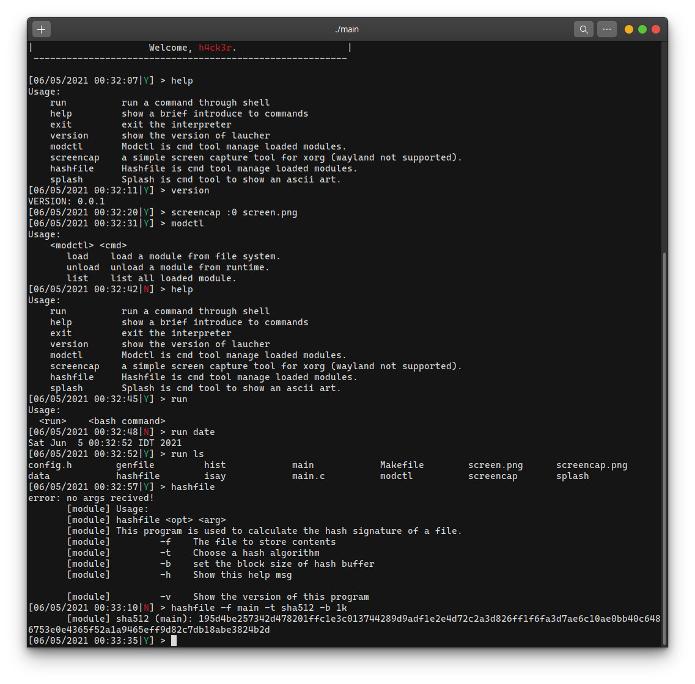

# C dynamically loadable module
Document and designs of my dynamically loadable module (based on BSD kernel module). 

To make something dynamically loadable, you will need a dynamic data structure at first. For the modules, I use doubly linked list written by myself `include/list.h`. Queue and stack are not good choices.

## Screenshots



## Dynamically loadable module
When you want to create a module, you must have a purpose, then you will need a **function** to make it. At the same time, you will also need some data or information to tell your function where and when it should operate. 

When a module is loaded, the loader will process initialization for a module, but how? The module may be created for different purposes, so their initialization must be different. One method is that: let the module define its initialization routine.
### module in shared library
So the loader will just get a pointer to the initializer, and then call it. Yeah, call it in the callback function way. And some necessary data/information should be sent to this callback. But the data can't be in the same type for all modules, it should be defined by the creator according to its requirements. So the loader will just pass a pointer (as void) to the data provided by the module to its initializer.

Usually, the destroy function and `init()` can be put into the same function. Let's name it as **load** or something. 
```C
int load(int cmd, void *extra)
{
	switch (cmd):{
		MODULE_LOAD: 
			// init;
			break;
		MODULE_UNLOA:
		 	// uninit;
			break;
		default:
			// some code
			break;
	}
	return /* something */;
}
```

Let's make a data struct for the module:

```C
struct module_data {
	const char 		*name;
	int 			(*load)(int , void *);
	void 			*extra;
};
```
The pointer to the extra information is implemented as void, but the load function the module itself knows how to '_decrypt_'.

After we wrote a module, it's time to compile it. The technique here is the dynamically loadable library, so we will compile this module as a shared library. And that's why we don't have a `main()` in the source of a module.

### load shared library dynamically
Next, we can load our precious module into the main program. But how? to load a dynamic loadable library, we will use `dlopen()`, `dlsymb()`, `dlclose()` and so on. [dlopen(3)](https://linux.die.net/man/3/dlopen) 

Here is a simple code to load a library at running time:
```C
#include <stdio.h>
#include <stdlib.h>
#include <dlfcn.h>

int
main(int argc, char **argv)
{
    void *handle;
    double (*cosine)(double);
    char *error;

    handle = dlopen("libm.so", RTLD_LAZY);
    if (!handle) {
        fprintf(stderr, "%s\n", dlerror());
        exit(EXIT_FAILURE);
    }

    dlerror();    /* Clear any existing error */

    *(void **) (&cosine) = dlsym(handle, "cos");

    if ((error = dlerror()) != NULL)  {
        fprintf(stderr, "%s\n", error);
        exit(EXIT_FAILURE);
    }

    printf("%f\n", (*cosine)(2.0));
    dlclose(handle);
    exit(EXIT_SUCCESS);
}
```

### Dynamically load a module
For loading a module, it's enough to just load the `module_data`. Note that, the dynamic module can't be released (`dlclose`) until you remove the module.

So we can't just push the `module_data` into a module list. There is much information for us to maintain until the end. Another data container is introduced for the main program. This data container includes all information about a module. For example: 
* **name** -- the code name for indexing.
* **module id** -- a specific identifier.
* **module data** -- stores the data will be used by the module itself.
* **dynamic library handler** -- Needed when release the module.
* **list entry** (never forget this) -- connected to the linked list.
```C
struct module{
    const char              *name;          /* Name of the module.*/
    unsigned int            modid;          /* Module id. */
    const struct module_data *moduledata;   /* Module data, module information included. */
    LIST_ENTRY(module)      m_list;         /* List of all modules. */
    void                    *modfile;       /* Pointer to module file */
};
typedef struct module module_t;
```

The process to get a module from file includes: 
1. allocate space for this module structure
2. open the library and get the symbol to `module_data`.
3. set the `modfile` to the library and set the `moduledata` to the `module_data` from the library.
4. Set `modid` with some hash functions, set the list entry to `NULL`.

Then the `Init` function will be called to init the module.
After that, the module will be inserted to the end/beginning of the module.
Finished!

### Release the module 
Wait! I just tell you how to load it. Remember what happens when you ride your new bike but don't know how to unmount?

To unmount, no, I mean to release a loaded module, the processes are just inverse:
1.  remove the module from the list
2.  release the loaded library with `dlclose()`.
3.  release the memory allocated for this module.

### API

API? no way.

```C 
struct module   *modread(char *);
int             modfree(struct module *mod);

int             modload(struct mod_list_h *, char *);
int             modunload(struct mod_list_h *, struct module *);

void            modshow(struct module *);
int             moddetail(char *arg);

int             modappend(struct mod_list_h *, struct module *);
int             modpop(struct mod_list_h *, struct module *);

int             modinit(struct module *mod);
int             moduninit(struct module *mod);
#include <stdarg.h>
int             mprintf(const char *, ...);

/* Functions for easy control the modules in the main list. */
int             modctl_load(struct mod_list_h *, char *);
int             modctl_unload(struct mod_list_h *, char *);

```

## Module template part 1: Built-in commands

## Module template part 2: System-calls


## More

### Version requirements 

### module dependence

### module library
